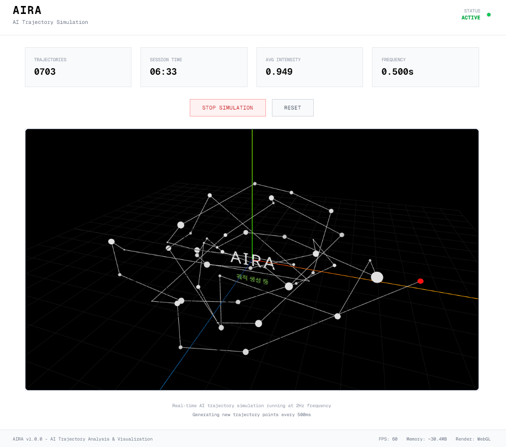

# AIRA: AI 궤적 시뮬레이션 - ✨[바로가기](https://aira-beta.vercel.app)
## 🎬 [Youtube Shorts 시연영상 바로가기](https://youtube.com/shorts/8g7Vpjk7X3E)



### 개요

Aira는 사용자의 유휴 컴퓨터 자원을 활용하여 **AI 에이전트의 응답 궤적(Response Trajectory)을 추적하고 시각화**하는 웹 애플리케이션입니다. AI의 행동 패턴과 다양성을 연구하며, 이를 아름답고 직관적인 데이터 시각화로 구현하는 것을 목표로 합니다.

-----

### 핵심 목표

  * **지속적인 데이터 수집**: AI 에이전트가 사전에 정의된 프롬프트를 바탕으로 작업을 반복 수행하며, 무작위성을 기반으로 다양하고 서로 다른 응답을 생성합니다.
  * **누적 데이터 저장**: 생성된 모든 응답 데이터를 MongoDB 또는 PostgreSQL(Neon DB)에 누적 저장합니다.
      * **핵심 데이터**: `id`, `timestamp`, `prompt_text`, `ai_response_content`
  * **미적이고 동적인 시각화**: 데이터를 단순한 목록이 아닌, **시간 흐름에 따른 궤적**으로 시각화합니다.
      * **예시**: 3D 노드-링크 다이어그램, 타임라인 기반 애니메이션
      * **디자인**: 미니멀하고 세련된 Next.js 및 Vercel의 디자인 감각을 반영한 화이트 & 블랙 테마.

-----

### 기술 스택 및 환경

#### AI 에이전트 개발 환경

  * **언어**: Node.js 또는 Python
  * **프레임워크**: Next.js (Server Actions 활용)
  * **데이터베이스**: Neon DB (PostgreSQL) 또는 MongoDB
  * **배포**: Vercel

#### 시각화 기술 스택

  * **프레임워크**: Next.js (Server Components 활용)
  * **시각화 라이브러리**: D3.js (데이터 처리), Three.js & React-Three-Fiber (3D 시각화)
  * **스타일링**: Tailwind CSS
  * **테스팅**: Jest, React Testing Library
  * **언어**: TypeScript

#### 개발 환경

  * **운영체제**: Windows 11 Home
  * **패키지 관리자**: Chocolatey
  * **프로젝트 의존성 관리**: Yarn

-----

### 실행 명령

  * **개발 서버 시작**: `npm run dev`
  * **테스트 실행**: `npm test`
  * **프로덕션 빌드**: `npm run build`
  * **타입 검사**: `npx tsc --noEmit`
  * **린팅**: `npm run lint`

-----

### 완료된 기능 및 성과

**Aira 프로젝트는 MVP(최소 기능 제품)를 성공적으로 완료했습니다. 현재는 서버 POST 요청 없이 실시간으로 클라이언트 측에서 궤적을 시뮬레이션하는 시스템으로 현대화되었습니다.**

  * **디자인 시스템**: 미니멀한 화이트 & 블랙 디자인이 적용되었으며, 재사용 가능한 디자인 시스템 문서를 마련했습니다.
  * **실시간 시뮬레이션**: 서버 요청 없이 클라이언트에서 0.5초마다 궤적을 생성하고 업데이트하는 실시간 시뮬레이션 알고리즘을 구현했습니다.
  * **3D 시각화**: Three.js 및 React-Three-Fiber를 활용하여 인터랙티브하고 유기적인 AI 궤적을 3D로 시각화합니다.
  * **코드 품질**: 하이드레이션 오류를 해결하고, 컴포넌트를 리팩토링하며, TypeScript 타입과 에러 핸들링을 적용했습니다.
  * **테스트**: Jest 및 React Testing Library를 사용하여 핵심 유틸리티 함수(13개)와 주요 컴포넌트(3개)에 대한 종합적인 테스트를 완료했으며, 모든 16개 테스트가 통과했습니다.
  * **문서화**: 디자인 시스템, 테스트 전략, 변경 로그 등 상세 문서를 작성했습니다.

**프로젝트 상태: ✅ 완료**

-----

### 프로젝트 파일 구조

```
src/
├── app/
│   ├── page.tsx               # 메인 페이지
│   ├── layout.tsx             # 루트 레이아웃
│   └── globals.css            # 전역 스타일
├── components/
│   └── TrajectoryVisualizer.tsx  # 3D 시각화 컴포넌트
├── utils/
│   ├── trajectory-utils.ts    # 핵심 유틸리티 함수
│   └── trajectory-utils.test.ts # 유틸리티 테스트
├── types/
│   └── jest-dom.d.ts          # Jest DOM 타입 정의
└── components/
    └── Home.test.tsx          # 컴포넌트 테스트

docs/
├── design-system-guide.md     # 디자인 시스템 문서
├── testing-guide.md           # 테스트 전략 문서
└── upgrade-log-realtime-simulation.md # 변경 로그
```
